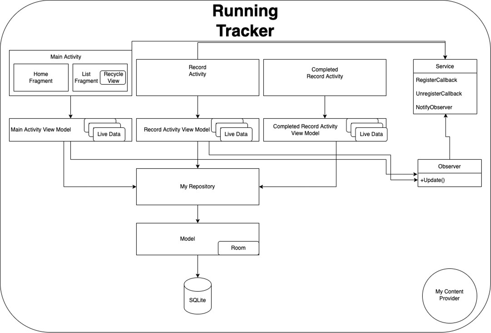
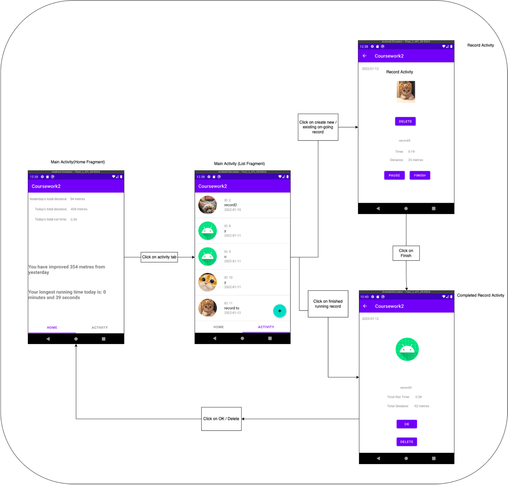

# running_tracker
Running Tracker Android Application

This application helps user to track their running activity based on distance and time.

3 Android main components are used:
- Activities
- Services
- Content Provider
- (x) Broadcast receivers

The app uses MVVM and Observer design patterns. Figures below outline the overview of the application architecture.

Design Flow:

## Demo Video:
https://drive.google.com/file/d/1wQr7vbE84QNOJGXKhBzdv3HcF6vgBj-A/view?usp=sharing
